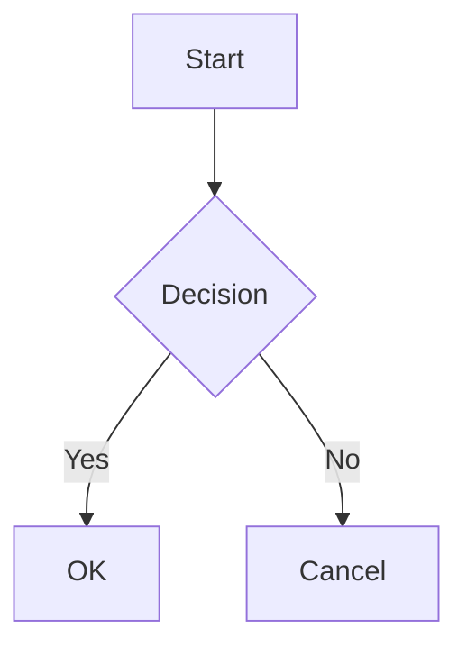

# Diagram Generation Instructions

When asked to create a diagram or graphic for a post, follow these steps:

1.  **Tool**: Use **Kroki.io**. Do **not** assume plugins like `jekyll-mermaid` are installed.
2.  **Format**: Produce an SVG image URL.
    *   Pattern: `https://kroki.io/{diagram_type}/svg/{encoded_string}`
3.  **Encoding**: The `encoded_string` is generated by:
    1.  Taking the diagram text (e.g., Mermaid code).
    2.  Compressing it with **zlib**.
    3.  Encoding the result with **Base64** (URL-safe).
4.  **Helper Script**: You can use the python script at `scripts/generate_kroki_url.py` to generate this URL. 
    *   Usage: `python scripts/generate_kroki_url.py` (Edit the script to include your diagram source first).

## Example Mermaid Diagram

## How to Embed
Use standard Markdown image syntax:
``
