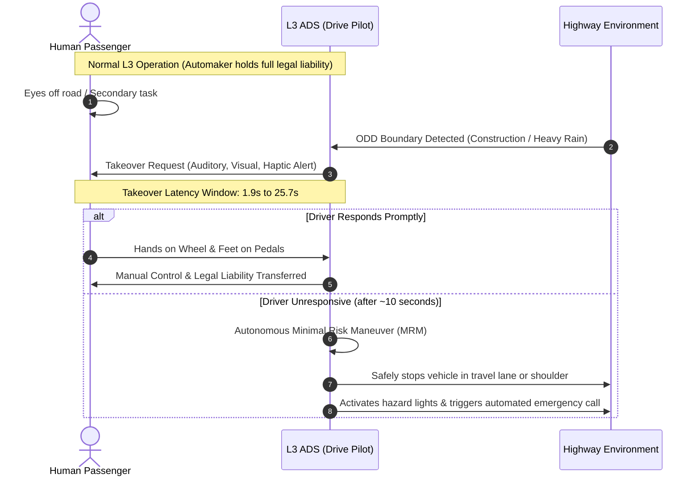
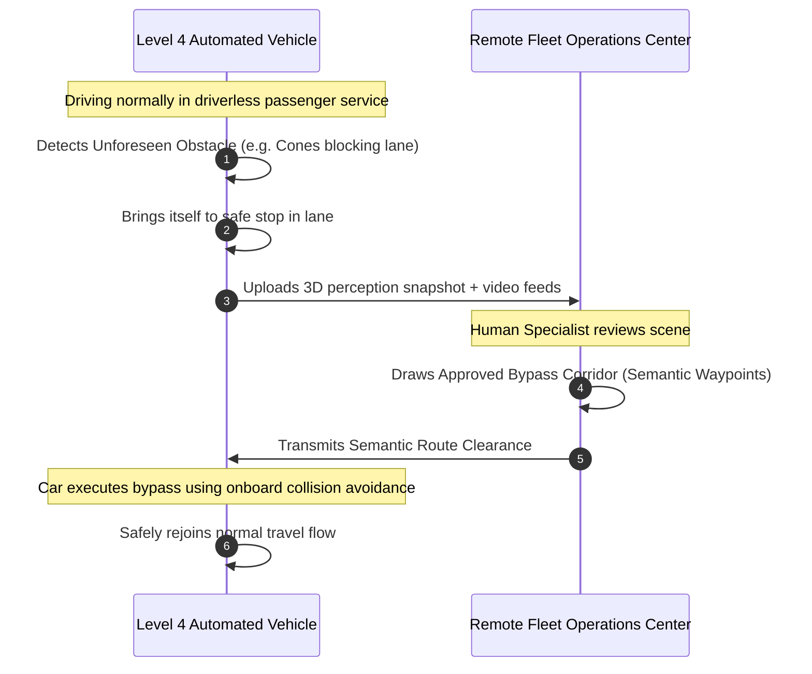

When car companies advertise driver-assist software, they often blur the line between convenient driver aids and true driverless autonomy. Marketing terms like "Autopilot," "Full Self-Driving," and "hands-free assist" make it sound as though the vehicle is driving itself, even when the human in the driver's seat remains entirely responsible if anything goes wrong.

To clear up this confusion, engineers and transportation regulators do not rely on marketing claims. Instead, they turn to a shared technical standard created by the **Society of Automotive Engineers (SAE International)**, a global standards body that develops engineering guidelines for the automotive and aerospace industries. 

### Quick Overview: The Six Levels at a Glance
* [**Level 0: No Automation**](#level-0-no-driving-automation): Warnings and emergency braking only. Human does all driving.
* [**Level 1: Driver Assistance**](#level-1-driver-assistance): Steering or cruise assist (one axis). Human controls the other and monitors everything.
* [**Level 2: Partial Automation**](#level-2-partial-automation): Simultaneous lane-centering and speed control (Tesla Autopilot, GM Super Cruise). Human remains legally liable at every second.
* [**Level 3: Conditional Automation**](#level-3-conditional-autonomy-and-the-handover-dilemma): Car drives on selected highways (Mercedes DRIVE PILOT). Manufacturer accepts liability until demanding a manual takeover.
* [**Level 4: High Automation**](#level-4-high-automation-within-bounded-operational-domains): Car or bus operates without human fallback within geofenced areas (Waymo, Baidu Apollo, ADASTEC). No driver required.
* [**Level 5: Full Automation**](#level-5-the-edge-case-frontier): Unconstrained driving anywhere, in any weather, with zero pedals or steering wheel. Still a research frontier.

In a benchmark document designated [SAE J3016](https://www.sae.org/standards/content/j3016_202104/) (where "J" indicates an SAE surface-vehicle standard and "3016" is its unique reference number), the organization defined an agreed-upon scale from Level 0 to Level 5. This framework has since been adopted by major international regulators, including the [National Highway Traffic Safety Administration (NHTSA)](https://www.nhtsa.gov/) in the United States and the United Nations Economic Commission for Europe ([UNECE](https://unece.org/)). It also serves as the basis for international standard [ISO/SAE PAS 22736](https://www.iso.org/standard/79585.html).

Instead of measuring vehicle intelligence with vague scores, the SAE standard evaluates two concrete engineering and legal questions:

1. **Who is actually driving?** In engineering terms, this is called the **Dynamic Driving Task (DDT)**. It covers both the immediate physical controls (steering, braking, accelerating) and tactical decisions (changing lanes, navigating turns, choosing safe following distances). It also asks who is responsible for scanning the surroundings, watching for hazards, and recognizing traffic signs, a task known as **Object and Event Detection and Recognition (OEDR)**.
2. **Who is legally responsible if something goes wrong?** Does liability stay with the person sitting behind the wheel, or does it shift to the automaker and the software controlling the car?

Crucially, the standard splits these six levels into two clear categories:

* **Levels 0 through 2 (Driver Support Systems / ADAS):** The vehicle assists the driver with features like lane-keeping or adaptive cruise control, but the human is always the legal driver. The driver must keep their eyes on the road and must be ready to take over steering or braking at any split second.
* **Levels 3 through 5 (Automated Driving Systems / ADS):** When the automated system is switched on within its designated operating zone, the machine is in full control. The software monitors the environment and handles emergency stops, shifting operational liability from the passenger to the vehicle's automated driving system.

Understanding how this responsibility moves from the human driver to onboard computing hardware explains where autonomous technology stands today, and why the biggest impact may be in public transit rather than personal cars.

<iframe width="100%" height="420" src="https://www.youtube.com/embed/x_Bsxz7Joqs" title="What Are The 6 Levels Of Automated Driving? (Engineering Explained)" frameborder="0" allow="accelerometer; autoplay; clipboard-write; encrypted-media; gyroscope; picture-in-picture; web-share" referrerpolicy="strict-origin-when-cross-origin" allowfullscreen></iframe>

---

## The SAE J3016 Automation Architecture Matrix

| Level | Formal SAE Category | Controls (Steering & Speed) | Environment Monitoring | Intervention Fallback | Legal Liability | Current Commercial Status |
| :--- | :--- | :--- | :--- | :--- | :--- | :--- |
| **L0** | No Driving Automation | Human Driver | Human Driver | Human Driver | Human | Ubiquitous (AEB, blind spot alerts) |
| **L1** | Driver Assistance | Shared (1 axis) | Human Driver | Human Driver | Human | Mass market (standard ACC or LKA) |
| **L2** | Partial Automation | Machine (both axes) | Human (must monitor) | Human Driver | Human | Ubiquitous (Tesla Autopilot, BlueCruise) |
| **L3** | Conditional Automation | Machine | Machine | Human (on alert request) | Manufacturer | Certified (Mercedes-Benz DRIVE PILOT) |
| **L4** | High Automation | Machine | Machine | Machine (auto safe stop) | Fleet / Operator | Scaled commercial fleets (Waymo, ADASTEC) |
| **L5** | Full Automation | Machine | Machine | Machine (any condition) | Manufacturer | Scientific research frontier |

---

## The Supervised Tiers (Levels 0 to 2): Machine Support Under Human Liability

Levels 0 through 2 represent Advanced Driver Assistance Systems (ADAS). In all three tiers, the human seated in the driver's cabin remains legally in command at every microsecond.

### Level 0: No Driving Automation
The vehicle's electronic control units (ECUs) do not continuously actuate steering or acceleration. The platform only issues sensory warnings or momentary emergency interventions:
* **Sensory alerts:** Blind Spot Information Systems (BLIS), Lane Departure Warning (LDW), Forward Collision Warning (FCW).
* **Momentary actuation:** Automated Emergency Braking (AEB) and Electronic Stability Control (ESC). Because AEB only activates for fractions of a second to mitigate an imminent crash, it does not constitute sustained longitudinal automation under SAE definitions.

### Level 1: Driver Assistance
The system provides continuous automated execution of a single control axis (either longitudinal or lateral) while the human driver executes the other:
* **Longitudinal assistance:** Standard Adaptive Cruise Control (ACC) modulating throttle and braking to maintain time-gap headway.
* **Lateral assistance:** Lane Keeping Assist (LKA) providing torque nudges to prevent roadway departure.
* The human remains responsible for all visual scanning, mirror checks, and steering input on the non-automated axis.

### Level 2: Partial Automation
The hardware simultaneously executes lateral lane-centering and longitudinal speed modulation. Common commercial implementations include Tesla Autopilot and "Full Self-Driving (Supervised)", General Motors Super Cruise, Ford BlueCruise, and BMW Driving Assistant Professional.

*Continuous machine execution across two physical axes (lateral lane centering and longitudinal adaptive cruise) operating under non-stop human supervision and 100% human legal liability. [Open and edit this diagram in Draw.io](https://app.diagrams.net/?grid=0&pv=0&border=10&edit=_blank#create=zZhhb9s2EIa%2F91fcFKzoUKSRLMtxqqiA62ZtAXcb4gLrPp7Fs82VIg2Ssq39%2BkGULcmxsiVGCsRffDodKfl5qZcnX2fbjxpXyy%2BKkQBkuLJ8TWMllDaJh7lV3rsXANdaKVsGANfZdkxCAGeJ53sXx8nAgxVqknZ3vir46fwcvnIrCM7Pj8f0PFijyCnxJrQmAT34A7XlKGCUW5Wh5Uq%2BhVFqcxfC2ryBCS1QwC2ZlZKGz7jgtvDA2EJQ4lna2nhpM5EEsbFafa9%2BUyKVpHjOhWgdouALmQia23hN2vIUxcilMs6YoHiz5JamK0wp2WhcxVrlkhFL%2FHiupJ3yfygJhlXsLh64uLrA2dx9Yg%2FKqWl7gCfwKhKOxUdSGVldwDbx%2Br4HReKFvgcbzuwy8Qa%2B78GS%2BGJpqzyaxFvshtQqXFRI28zflzeLuoCxkha5JP0WvmC65JLgZktp7nh2aRLWmhzX17O%2BmqAljQJew0TJBbc54xLFL7UQZsMzgfKY4k6cRouzgHpX4exArjO%2FN%2Bynl22g4XDG5oe494IEMerU6TGMjUVdaRP2T6M%2FbOj3oxb9XvQI%2FL8pRrBn1EW5X1N%2BKWw8e7mw8b58tOWmTF64rDutL6oCSTAmaUlzuYCRMdzYmnhD4%2F%2BR%2B%2BHgCg%2BfkDbgwzW8hxv43UDD%2B4D2Igc0imqgwWUL6ODRPFsrrRNq1AG1PeZesqOdAcJY59yQe2i0Es%2BfbdB%2FKri%2F5uY%2BRxgcYy0BcZmr3MAtoTj%2FyjNqfLqT8ZRnubAoqRw0XRExeA1TS24xn0a6MokD0peMhfP0aUlXvnDVJh01pMv4oaTHSkpKrdIGuDScUe3JtbN2CXBZ4yG2oMr%2BlLZLtVASxc0%2B1zLE5uxEqVUSxH%2BTtYUDUG7ue5i05fbb7vuvxH8TuejDNvGroCgDaXXxbR%2BUVWFUxVWdi8rCrhVf5f502HqxB%2BX938EORuU6JWeJFvWCytXbKYYmgeVT6iZ4CPIWwuHzQjj4MQijJ0d4Xy%2FxKc9Qwu8r0miV7ly1V7Vt3Cl%2BFfj%2Bz7s%2BbsKxauGerHWgIGD9Q6%2BdXQbD6Ee2DtHgqHcIe6f2DhWtm4JMJ9bA%2F287VshgmqKUXC46jdjNnOXGgqYMuQQlQStkGyxOsuEZBb0wPRRhzrCP8xNs%2BOrhzUTv1P2uAvwJJbuHcHBM%2BLM0FqWFz2X3tSbp2uFbQsYlme6morqAkrBZEgnQhKwAq8CUe97FTON3ev682w3GycB3217ZtE7zFek1d73GpNz4OgVo3gv39cTKWZwGooD3xfOy8we4%2BbwfziO64%2BYMzdLdXVu4Rsq9W3WYftCYftiYfreajzD9Mq7e%2Bctc8xfBuxf%2FAg%3D%3D)*

While Level 2 systems can create the visceral sensation of autonomous navigation, their operational safety model depends entirely on continuous human vigilance. Research from the [MIT Advanced Vehicle Technology (MIT-AVT) Consortium](https://doi.org/10.1109/ACCESS.2019.2926040) has empirically documented the dangers of partial automation:
* In a landmark study on naturalistic glance behavior around Tesla Autopilot disengagements ([Morando, Gershon, Mehler, & Reimer, 2021](https://doi.org/10.1016/j.aap.2021.106360)), researchers found that drivers exhibit significantly higher rates of off-road glances toward the central touch screen and personal devices when Level 2 features are engaged compared to manual driving.
* Crucially, [Morando et al. (2020)](https://doi.org/10.1177/0018720820945113) discovered that in **33% of driver-initiated disengagements**, drivers were not holding the steering wheel prior to taking back control, resulting in measurable delays in physical intervention.

To combat this "automation complacency," modern Level 2 platforms have deployed active Driver Monitoring Systems (DMS):
1. **Capacitive touch steering rims:** Replacing older steering-column sensors (which measured torque and could be fooled by hanging weights on the wheel) with touch-sensitive rims that detect skin contact directly.
2. **In-cabin infrared cameras:** Tracking head position, eye gaze direction, and eyelid closure rates to ensure the driver is still looking forward at the roadway.

---

## Level 3: Conditional Autonomy and the "Handover Dilemma"

Level 3 marks a major legal transition: when the automated system is switched on, the manufacturer assumes **legal liability for driving**. The human in the driver's seat is legally allowed to take their eyes off the road, whether to glance at messages, browse infotainment menus, or speak with passengers.

However, Level 3 systems operate only within a strictly bounded **Operational Design Domain (ODD)**. In automotive engineering, an ODD is simply the specific set of real-world conditions under which a system is designed and certified to function:
* Road conditions: Structurally divided highways with clear physical lane barriers and no oncoming traffic, pedestrians, or cyclists.
* Weather limits: Clear daytime weather, without heavy rain, fog, or snow obscuring lane markings.
* Operating boundaries: Digitally pre-mapped highway stretches, no active construction zones, and strict speed limits.

### The Handover Dilemma and Takeover Latency
The central challenge for Level 3 systems is what human factors researchers call **takeover latency**: the time it takes an off-duty human driver to recognize an alert, understand traffic conditions, and safely resume physical control of the car. When the car approaches the boundary of its operating conditions (such as entering a construction zone or encountering heavy downpours), it issues a **Takeover Request (TOR)**.

In a landmark review published in *Human Factors*, [Eriksson and Stanton (2017)](https://doi.org/10.1177/0018720816685428) investigated handover transitions in automated driving. In non-emergency situations, driver response times ranged from **1.9 to 25.7 seconds**, with a typical response taking 4.5 to 6.0 seconds. Further simulator tests by [Gold et al. (2013)](https://doi.org/10.1177/1541931213571433) and [Merat et al. (2014)](https://doi.org/10.1016/j.trf.2014.09.005) found that even after drivers placed their hands back on the wheel, stabilizing lane position and vehicle speed required **8 to 10 seconds**.

At highway speeds (such as 100 km/h or 62 mph), a car travels 27.8 meters per second. A 6-second transition latency means the vehicle covers more than 166 meters while the driver shifts focus from a smartphone or video screen back to the road.

If the driver fails to take control after repeated visual, acoustic, and vibrating alerts, the system must execute what engineers call a **Minimal Risk Maneuver (MRM)** to reach a **Minimal Risk Condition (MRC)**. In plain language, the car must safely bring itself to a stop in its lane or on the shoulder, switch on hazard warning lights, and place an automatic emergency call.

### Commercial implementation: Mercedes-Benz DRIVE PILOT
The first automaker to achieve internationally recognized commercial approval for an SAE Level 3 system was Mercedes-Benz with its [DRIVE PILOT](https://group.mercedes-benz.com/) system:

* **Regulatory certification:** Certified under [UN Regulation No. 157](https://unece.org/transport/documents/2021/03/standards/un-regulation-no-157-automated-lane-keeping-systems-alks) (the international United Nations rulebook for Automated Lane Keeping Systems) by Germany's federal transport authority ([Kraftfahrt-Bundesamt, or KBA](https://www.kba.de/)) in December 2021, and launched on production S-Class and EQS sedans in Germany in 2022.
* **Expanding speed limits:** Under initial UN rules, the system was restricted to traffic-jam speeds of up to **60 km/h (37 mph)**. After updated regulatory approvals, Mercedes-Benz secured clearance from German authorities in late 2024 to raise DRIVE PILOT's top operating speed to **95 km/h (59 mph)** on German Autobahn corridors.
* **United States approvals:** Granted commercial operating approval by state authorities in [Nevada](https://dmv.nv.gov/) (January 2023) and the [California DMV](https://www.dmv.ca.gov/portal/vehicle-industry-services/autonomous-vehicles/) (June 2023) for designated freeway routes during congested traffic.
* **Redundant hardware stack:** Uses front-mounted laser radar (**LiDAR**), long-range radar, stereo optical cameras, road-moisture sensors inside wheel wells, centimeter-grade satellite positioning, and high-definition 3D vector maps. Crucially, it includes duplicate backup steering motors, backup braking boosters, and an independent secondary 12-volt electrical circuit.
* **Exterior turquoise marker lights ([SAE J3134](https://www.sae.org/standards/content/j3134_201905/)):** Mercedes-Benz became the first automaker authorized by California and Nevada to display turquoise exterior status lights built into headlights, taillights, and side mirrors. Engineers chose turquoise because it cannot be confused with flashing blue or red emergency vehicle lights, amber turn signals, or brake lamps. It lets surrounding motorists and traffic officers instantly see that the car's automated system, not the person in the front seat, is in legal control of driving.

<iframe width="100%" height="420" src="https://www.youtube.com/embed/AiUUgVuqH98" title="Hands-free on the Autobahn with Mercedes-Benz Drive Pilot" frameborder="0" allow="accelerometer; autoplay; clipboard-write; encrypted-media; gyroscope; picture-in-picture; web-share" referrerpolicy="strict-origin-when-cross-origin" allowfullscreen></iframe>

---

## Level 4: High Automation Within Bounded Operational Domains

Because Level 3 transfers operational risk back to an out-of-the-loop human during sudden road hazards, many leading autonomous developers (such as Waymo, Zoox, and Baidu Apollo) chose to bypass Level 3 entirely and focus directly on **Level 4**.

At Level 4, the vehicle is architected **never to ask an occupant to take the wheel**. If the vehicle encounters heavy weather exceeding its operating limits, a damaged sensor, or a road blockage it cannot navigate, it executes its own fallback stop safely on the shoulder or within its lane without human help. Everyone inside is strictly a passenger.

*Two distinct Level 4 operational deployment domains: consumer robotaxis in geofenced metro areas versus municipal mass transit buses operating along dedicated transit corridors. [Open and edit this diagram in Draw.io](https://app.diagrams.net/?grid=0&pv=0&border=10&edit=_blank#create=1ZjdcuI2GIbP9yq%2BOjOZ7Aw0GAghYemMAw5xw99gJ7s9%2FLA%2Fg2ZlyZVkQvao99Ab6VnP91J6JR1DFsgm2ySU%2FoQjIVu29TyS%2FMrvknlHYTrtyYg4YISpYTNqSS6VblqYGWn98AbgnZLS5AWAd8m8RZwDi5pWyTp8WGlbkKIiYe6OL0%2F4rliEgBlOsA9%2BNjaLYrH4sHnZghnyjJqW77jQpRlxqMIFm0zByYxM0DApTiG4kdBmM1ITEgbalHJ5m%2BTFIZqptkCbW05Ny9DcNKYm4U27oY2SH5d9awopqBEzzjf%2BImcT0eQUm8aMlGEhcmdRlbAo4tS4mTJDfoohNW8Upg0lMxFR1Cw1YimMzz5R064vy4ub24vy8gZ78eLXsCC%2FNM3vYbKtJYYFiA7JhIy6hXnTqpYsuG1a5SMLblhkpk3ruFSyYEpsMjVNq1KyAHXTmtw1Wdk4XPJ8BO54RbfNFIUGQpmkqJiWAjBUUmtgEYlF50GmpBa4kUPEEhKaSaHhhpkpfCIlgYliiGMmIFK5CoiR8zGGH%2F8z%2FOVN5CdVrIzr2yE%2F%2Bgby8pPI18O9JXmWCLBP4UqNUcBIjqXBOdOPjvvKyszV6Mzpw2hwNgicD54PB0PH991%2Bxx3ByGu7xQvH63r9ztsVZX3DEo7iIaI78mvQezaVTyrjey72KuN6Oa5tkquV8CjGe0P5C227gSpcwK43tEG1BF%2BpbYe5vsZctTdHdvXFQ7u64rfPTWN8x2b%2F50yaRph363SvUh9Hcb2xrNufmMZg6I6cwOt3oD3oOV7%2FNG96OM4PLS6iDvNih2RMIqQI8keREEtpUsWE0XDgo4BzhSJkOpQFGE4lCTYvwPtsimJtaE3vOYoqWMenFN2tJ2sZG9NHpxgyMelSbPIp8aiZyrfMlJdmqvWVmcrxhpm8%2FmVijrYQc%2B1eeK2uC8OuE5wPRr3HxXTzR4IUtSYxIQXEKTSKhTCjKQs5aTgIZZKQChly8K%2BuNaCIQFOEQr9mOXapuis7tS3sDN1Ryx0G3qAPfuC0Lh%2B3U6mVPv8GSsoYuqztjHQBWIITJiagMEJVAJ2pBXsIMSGFugAXbZhRaKSCBFP9mg3VSrsydLyFId8dXXstF3qDttt9XM9AFCNK8vkQSqGzhBQoFlFxioznjjBNNRy8x9tEwkBQAZxUci6hI1%2FzzCnbtV15qW%2Fh5cztty56zugSzruuG%2FgbamCFGg5%2BxEmGCrzi0Gm5b%2BHz73CGLMq%2BKBgFta0UlGL7uPy1gkrVPjq6p6AeYxw%2BS8E6eNlb6qh%2Fa5q8PGeVT6GXCRayFDn0UGsIFArNzKNx62Rlr3fV91re0OlCz%2FF9CEZO3%2FcCOGh5114LeoMzr%2BsFP%2B0sbdml8Un93tagUo0qJyf%2FaNqq7zxu5c2fHP7Ljr00b52zeZ61Vi6VzAzpAkQUsRANRXA2CiCUSrFIKl3IXx9ppoFLueU7o1Sr0tOe%2Fu7adPKvRS7b3kLO8zLXBeHsFjZi1Sp0mbvZdlD%2F45df7XKyedI407Rl4vp%2FuNlh4rLLW8h5XuS6W%2FCKE4URQZJxw4qL7FV4ELlkalioC5AqJhUzt3Bd%2FvCa%2Fewub9mVLfw8I3D54ZSijFMEIZvl84UlZHCcb1P2MUkbsKBeNFMqhlyGHyEmiki9%2BmVth5HLfs4m%2F2s1f5W5nLbjB24LYi5v8vT7PTKQAi5RaRSL741CJjLTQEUncC5fSep60sj2qSsvL78F53XrT8c%2FvPkT)*

### 1. Urban Robotaxis: The Commercial Global Battleground

While early autonomous testing was dominated by Silicon Valley tech pilots, urban robotaxis are now in active commercial revenue service across thousands of square miles globally.

#### The US Market: Waymo and Tesla's Competing Philosophies
The United States has emerged as a stark contest between multi-modal sensor fusion and pure vision:

* **[Waymo One](https://waymo.com/) (Alphabet):** The commercial pacesetter in driverless ride-hailing. Operating across **Phoenix**, **San Francisco**, and **Los Angeles** (with active expansions in **Austin** and **Atlanta** in partnership with Uber), Waymo logs hundreds of thousands of paid driverless trips each week. Its multi-sensor architecture combines roof-mounted LiDARs, imaging radar, optical cameras, and external microphone pods. Under mandatory federal incident reporting from the [NHTSA Standing General Order](https://www.nhtsa.gov/laws-regulations/standing-general-order-crash-reporting), Waymo's dataset spanning more than 270 million rider-only miles shows an **82% reduction in injury crashes** and a **95% reduction in serious injury crashes** compared to human drivers, corroborated by research from the [Insurance Institute for Highway Safety (IIHS)](https://www.iihs.org/).
* **[Tesla](https://www.tesla.com/) (Autopilot, FSD Supervised, and Cybercab):** Tesla rejects LiDAR and HD maps in favor of an end-to-end neural network running exclusively on optical cameras ("Tesla Vision"). Consumer Teslas remain classified strictly as **SAE Level 2 (Supervised)** because the human driver retains total legal liability at all times. In late 2024, Tesla unveiled the dedicated two-seat **Cybercab** robotaxi concept without steering wheels or pedals, aiming to jump directly from consumer Level 2 to uncrewed Level 4 commercial ride-hailing through future unsupervised software updates.

<iframe width="100%" height="420" src="https://www.youtube.com/embed/u0Iv3jvCDaE" title="Waymo Driverless Car in San Francisco | First Ride on City Streets" frameborder="0" allow="accelerometer; autoplay; clipboard-write; encrypted-media; gyroscope; picture-in-picture; web-share" referrerpolicy="strict-origin-when-cross-origin" allowfullscreen></iframe>

#### The Chinese Market: Massive Scale and Multi-City Saturation
China has rapidly scaled the world's highest-density driverless robotaxi deployments, supported by dedicated municipal smart-city infrastructure and vehicle-to-everything (V2X) sensor networks:

* **[Baidu Apollo Go](https://apollo.auto/) (RT6):** Operating across major Chinese metropolises including **Wuhan**, **Beijing**, **Shenzhen**, and **Shanghai**, Baidu's Apollo Go fleet has completed millions of fully driverless commercial orders. In Wuhan alone, hundreds of sixth-generation **Apollo RT6** fully electric robotaxis navigate densely populated streets, bridges, and severe traffic corridors completely uncrewed.
* **[Pony.ai](https://www.pony.ai/) and [WeRide](https://www.weride.ai/):** Both technology providers run licensed commercial driverless fleets across Guangzhou, Beijing, and international pilot sites in the UAE and Singapore. Their fleets incorporate customized electric platforms from Chinese automakers like **GAC**, **FAW**, and **Geely / Zeekr**, featuring multi-sensor LiDAR arrays integrated directly into production vehicle chassis.

<iframe width="100%" height="420" src="https://www.youtube.com/embed/xvitD_7jmUw" title="Experience Driverless Robotaxis in Wuhan | Baidu Apollo" frameborder="0" allow="accelerometer; autoplay; clipboard-write; encrypted-media; gyroscope; picture-in-picture; web-share" referrerpolicy="strict-origin-when-cross-origin" allowfullscreen></iframe>

### 2. Autonomous Municipal Transit: Electric Buses in Public Fleets
While passenger robotaxis like Waymo dominate news coverage, municipal public transit represents the practical vanguard of Level 4 automation. Deploying driverless technology in public transportation solves chronic driver shortages and expands fixed route service.

Rather than retrofitting consumer passenger sedans, commercial bus builders collaborate directly with specialized autonomous software providers. The primary global partnership leading full-size automated transit brings together two specialized entities:
* **[Karsan](https://www.karsan.com/):** A prominent commercial vehicle manufacturer based in **Bursa, Turkey**, with decades of experience producing electric city buses exported across Europe and North America.
* **[ADASTEC](https://www.adastec.com/):** An automated driving software firm founded in **Istanbul, Turkey**, and headquartered in **Farmington Hills, Michigan (USA)**, that builds `flowride.ai`, a specialized Level 4 software stack tailored specifically for full-size heavy commercial buses and municipal operations.

Their joint flagship vehicle is the **Karsan Autonomous e-ATAK**, an 8.3-meter, 52-passenger fully electric bus equipped with LiDAR, radar, high-definition optical cameras, and redundant braking systems. It has achieved real-world commercial route deployments across multiple continents:
* **Stavanger, Norway (Kolumbus Line 18):** Operating in open mixed traffic since 2022, this deployment reached a historic regulatory milestone by receiving formal authorization from Norwegian transport authorities to operate in scheduled public transit service without an in-vehicle safety driver behind the wheel.
* **Michigan State University (MSU, USA):** Deployed in 2022, the Autonomous e-ATAK operates on a 2.5-mile non-stop route connecting the MSU commuter lot to the campus transit center, making it the first full-size automated bus deployed on public roads in the United States.
* **Paris, France (RATP Line 393):** Completed extensive operational trials on a high-frequency Bus Rapid Transit (BRT) corridor in the Île-de-France region, negotiating complex dedicated bus lanes, multi-lane roundabouts, pedestrian crossings, and priority traffic signals.
* **International Expansion:** Further deployments and commercial pilots have been established in **Arbon (Switzerland)**, **Rotterdam The Hague Airport (Line 533)** in the Netherlands, and municipal campuses in **Romania** (Ploiești Industrial Park and Cluj-Napoca).

---

## The Operational Realities: On-Board Safety Stewards and Remote Fleet Response
 
In many cities piloting autonomous transit shuttles, riders frequently notice a staff member or safety attendant seated on board.

Having an attendant inside an automated bus is not an indicator that the self-driving technology has failed. It reflects straightforward legal, accessibility, and operational requirements during real-world deployments:

1. **Passenger accessibility:** An autonomous perception stack cannot assist a passenger using a wheelchair, operate a manual boarding ramp, secure four-point floor belts, help visually impaired riders navigate to seats, or resolve fare disputes during peak rush hours. In the United States, compliance with the [Americans with Disabilities Act (ADA)](https://www.ada.gov/) often necessitates staff assistance.
2. **Regulatory transition periods:** Transportation rules, including European Union [Regulation (EU) 2022/1426](https://eur-lex.europa.eu/eli/reg_impl/2022/1426/oj) for automated vehicles and United States commercial vehicle exemptions, routinely require certified safety personnel on board during initial public deployment stages before authorities grant fully uncrewed commercial licenses.
3. **Remote fleet support instead of direct remote driving:**
   As fleets gain operational mileage, onboard technicians give way to **remote fleet assistance centers**. Importantly, remote support does **not** mean someone driving the car like a video game over cellular data:
   * Direct joystick driving over mobile networks is dangerous because network lag (latency spikes) and lost signals can delay emergency braking.
   * Instead, systems like Waymo Fleet Response and ADASTEC Remote Operations provide **high-level route guidance**. When an automated vehicle meets an unexpected obstruction (such as construction cones pushing traffic across a solid double-yellow line, or a police officer directing traffic with hand gestures), the car brings itself to a safe stop and asks fleet control for guidance. A human specialist views the vehicle's 3D cameras, confirms an approved path around the obstacle, and hands execution back to the car's local obstacle avoidance software.

---

## Level 5: The Edge-Case Frontier

Level 5 represents **universal, unconstrained autonomy**. An SAE Level 5 vehicle must be capable of operating under all roadway conditions, across any drivable geography, in any weather, anywhere on Earth, with zero human intervention and no requirement for steering wheels, pedals, or manual controls.

Level 5 remains a scientific research frontier rather than a commercial product. The engineering challenges separating Level 4 from Level 5 are profound:
* **Adverse Weather Physics:** In heavy blizzards, freezing sleet, or torrential monsoon downpours, optical camera lenses become obscured, airborne snowflakes cause near-field LiDAR beam backscatter, and lane markings disappear entirely beneath packed snow or standing water.
* **Open-World Semantic Reasoning:** A Level 5 system cannot rely on pre-scanned millimeter-accurate High-Definition (HD) vector maps. It must navigate unpaved dirt trails, unmarked desert roads, dynamic detours with hand-scrawled detour signs, and nuanced human social interactions (e.g., eye contact and subtle hand gestures from construction workers or local drivers).
* **The Long Tail of Rare Events:** Machine learning models trained on millions of urban highway miles still struggle when encountering rare, out-of-distribution physical edge cases that a human driver negotiates using general commonsense physics and intuition.

Because solving every edge case globally is unnecessary to deliver safe urban transit, leading autonomous vehicle developers focus their capital on expanding the operational envelopes of **Level 4** systems.

---

## Strategic Takeaway: Why This Matters to Everyday Commuters

For everyday drivers and riders, the debate over autonomous vehicles is often framed around luxury passenger cars: whether someone can nap on the way to work or let their personal Tesla drive them home. 

In reality, the most immediate transformation will be seen in municipal public transit rather than private car ownership.

Cities worldwide face severe everyday transit bottlenecks:
* Severe shortages of licensed bus drivers leading to canceled runs and stranded riders.
* Rising operating costs that cause transit agencies to slash late-night routes and weekend service.
* Expanding transit deserts that leave suburban residents without dependable connections to rail lines or job centers.

Deploying SAE Level 4 automated electric shuttles along designated routes, bus rapid transit corridors, and neighborhood loops directly addresses these issues. By running predictable, high-frequency neighborhood feeder loops around the clock without driver-shift bottlenecks, autonomous transit connects residential areas directly to regional transit hubs. It shifts autonomous technology away from high-priced executive toys and toward affordable, reliable public infrastructure that commuters can rely on every single day.

---

## Key Sources and Engineering Literature

1. **SAE International / ISO:**
   * SAE International (2021). *Taxonomy and Definitions for Terms Related to Driving Automation Systems for On-Road Motor Vehicles* (Standard J3016_202104 / ISO/SAE PAS 22736:2021). [SAE Standard J3016](https://www.sae.org/standards/content/j3016_202104/).
   * SAE International (2019). *Automated Driving System (ADS) Marker Lamp* (Standard J3134_201905). [SAE J3134](https://www.sae.org/standards/content/j3134_201905/).

2. **International Regulations & Government Type-Approvals:**
   * United Nations Economic Commission for Europe (UNECE). *UN Regulation No. 157: Uniform provisions concerning the approval of vehicles with regard to Automated Lane Keeping Systems (ALKS)*. [UN-R157 ALKS Documentation](https://unece.org/transport/documents/2021/03/standards/un-regulation-no-157-automated-lane-keeping-systems-alks).
   * National Highway Traffic Safety Administration (NHTSA). *Standing General Order 2021-01 for Crash Reporting: Incident Notification for Automated Driving Systems (ADS) and Level 2 ADAS*. [NHTSA SGO Reporting](https://www.nhtsa.gov/laws-regulations/standing-general-order-crash-reporting).
   * European Commission (2022). *Commission Implementing Regulation (EU) 2022/1426: Laying down rules for the application of Regulation (EU) 2019/2144 as regards uniform procedures and technical specifications for the type-approval of the automated driving system (ADS) of fully automated vehicles*. [EUR-Lex](https://eur-lex.europa.eu/eli/reg_impl/2022/1426/oj).

3. **Human Factors, Disengagement, and Takeover Latency Research:**
   * Eriksson, A., & Stanton, N. A. (2017). *Takeover Time in Highly Automated Vehicles: Noncritical Transitions to and from Manual Control*. **Human Factors: The Journal of the Human Factors and Ergonomics Society**, 59(4), 689-705. DOI: [10.1177/0018720816685428](https://doi.org/10.1177/0018720816685428).
   * Morando, M. M., Gershon, P., Mehler, B., & Reimer, B. (2021). *A model for naturalistic glance behavior around Tesla Autopilot disengagements*. **Accident Analysis & Prevention**, 161, 106360. DOI: [10.1016/j.aap.2021.106360](https://doi.org/10.1016/j.aap.2021.106360).
   * Morando, M. M., Gershon, P., Mehler, B., & Reimer, B. (2020). *Driver-initiated Tesla Autopilot Disengagements in Naturalistic Driving*. **Human Factors: The Journal of the Human Factors and Ergonomics Society**. DOI: [10.1177/0018720820945113](https://doi.org/10.1177/0018720820945113).
   * Fridman, L., et al. (2019). *MIT Advanced Vehicle Technology Study: Large-Scale Naturalistic Driving Study of Driver Behavior and Interaction with Automation*. **IEEE Access**, 7, 102021-102038. DOI: [10.1109/ACCESS.2019.2926040](https://doi.org/10.1109/ACCESS.2019.2926040).
   * Merat, N., Jamson, A. H., Lai, F. C., Daly, M., & Carsten, O. M. (2014). *Transition to manual: Driver behaviour when resuming control from a highly automated vehicle*. **Transportation Research Part F: Traffic Psychology and Behaviour**, 27, 274-282. DOI: [10.1016/j.trf.2014.09.005](https://doi.org/10.1016/j.trf.2014.09.005).
   * Gold, C., Damböck, D., Lorenz, L., & Bengler, K. (2013). *"Take over!" How long does it take for a driver to take over control of a vehicle?* **Proceedings of the Human Factors and Ergonomics Society Annual Meeting**, 57(1), 1938-1942. DOI: [10.1177/1541931213571433](https://doi.org/10.1177/1541931213571433).

4. **Commercial Deployment Milestones and Safety Benchmarks:**
   * Waymo LLC (2024 to 2026). *Safety Performance Data and Human Driver Benchmark Comparisons Across Rider-Only Miles*. [Waymo Safety Transparency](https://waymo.com/safety/).
   * Insurance Institute for Highway Safety (IIHS, July 2026). *Comparison of Real-World Autonomous Vehicle and Human Crash Rates per Vehicle Mile Traveled*. [IIHS Research](https://www.iihs.org/).
   * Mercedes-Benz Group AG (2021 to 2025). *DRIVE PILOT: System Architecture, UNECE R157 Certification, and SAE J3134 Turquoise Marker Lamp Specifications*. [Mercedes-Benz Technology News](https://group.mercedes-benz.com/).
   * ADASTEC Corporation & Karsan (2022 to 2026). *Deployments of Level 4 flowride.ai on Karsan Autonomous e-ATAK Across Stavanger (Kolumbus), Michigan State University, and Paris (RATP Line 393)*. [ADASTEC Deployments](https://www.adastec.com/).
